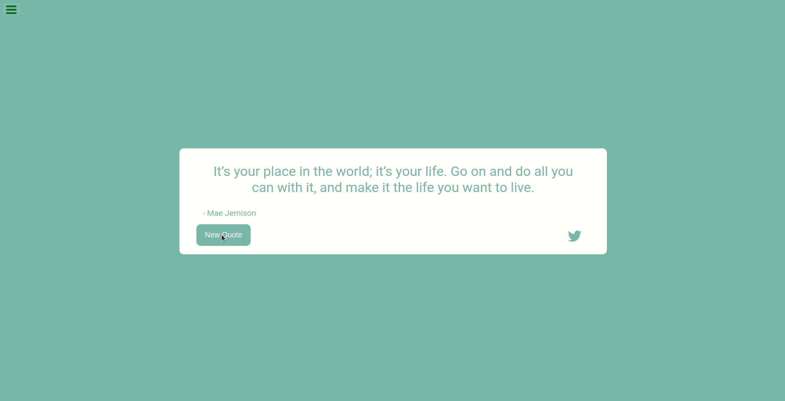

# QUOTE FOR THE DAY

A web application that can generate a random famous quote that inspires your day.

    

## Motivation

This is my first project in using Reactjs to build a small but useful application. Through this project, I know about the fundamentals of React such as class componets, functional components, etc.

## Languages, Libraries and Frameworks Used

This project was built with:
* Reactjs: used to build the main components of the application.
* Vanilla JS: used to implement some helper functions.

## Installation

In order to run and test this application, first clone this repository to your local computer. Then, open the terminal and move into the folder containing the source code. 

Once you are in the right directory, run the following command to install all the necessary dependencies:

<code>~$ npm install</code>

Once all the dependencies are installed, run this command to run compile and run the code in development mode:

<code>~$ npm run start</code>

To create a production version of the app (for deployment), run the following command:

<code>~$ npm run build</code>

## How to Use

#### 1. Generating a new quote

It is very simple to use this app, the famous quote is displayed in the middle of the screen along with its author. Then, to generate a new quote, you just need to click the <button>New quote</button> button on the screen. 

#### 2. Tweeting a quote

If you find some quote interesting and you want to tweet it, simply click the Twiiter button at the right corner of the quote box.